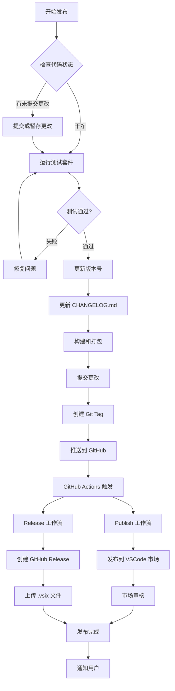
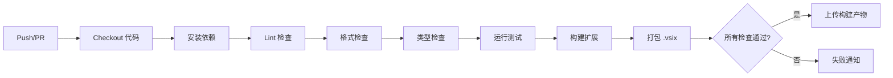
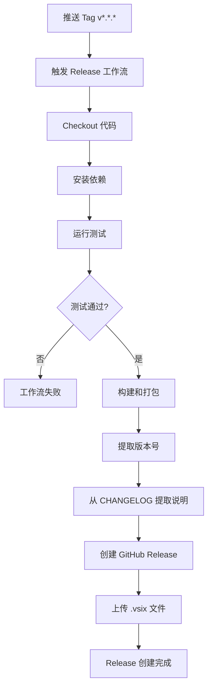
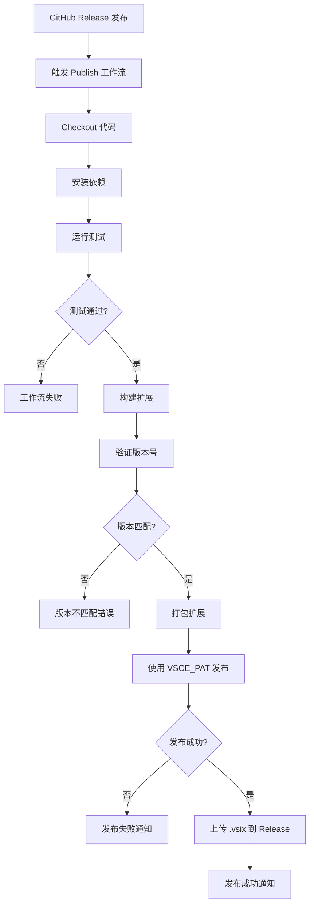
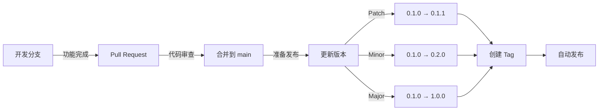
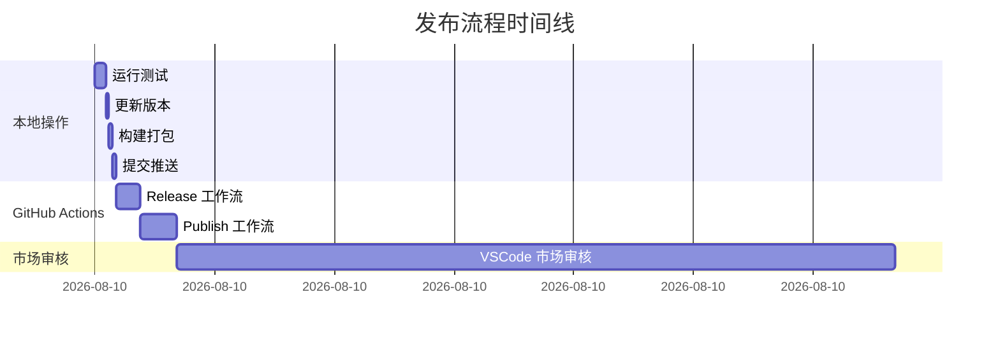
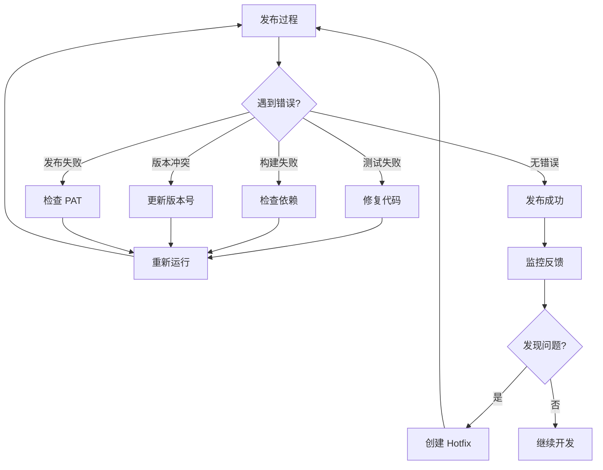
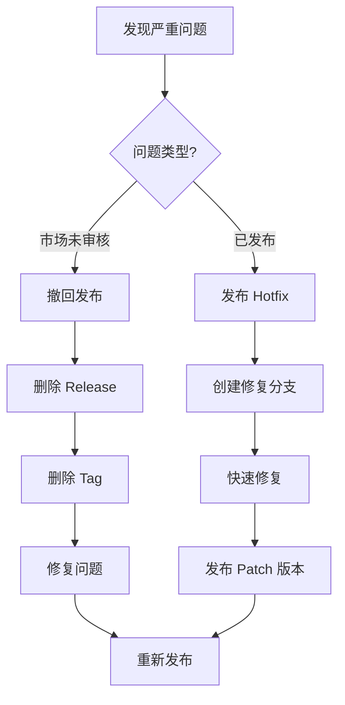
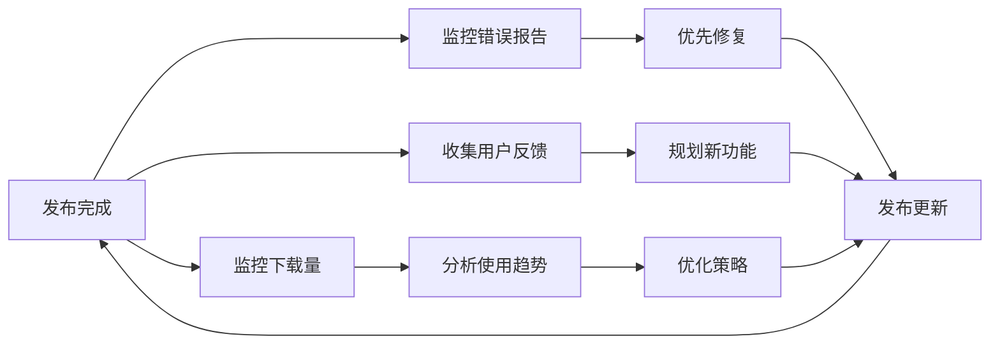

# 发布工作流程图

## 完整发布流程



## 自动化工作流详解

### 1. CI 工作流 (持续集成)



**触发条件:**
- Push 到 main 或 develop 分支
- Pull Request 到 main 或 develop 分支

**执行矩阵:**
- 操作系统: Ubuntu, Windows, macOS
- Node.js: 18.x, 20.x

### 2. Release 工作流 (创建发布)



**触发条件:**
- 推送格式为 `v*.*.*` 的 tag

**输出:**
- GitHub Release 页面
- 附带 .vsix 文件下载

### 3. Publish 工作流 (发布到市场)



**触发条件:**
- GitHub Release 状态变为 "published"

**要求:**
- GitHub Secret: `VSCE_PAT` (Azure DevOps Personal Access Token)
- package.json 中的 publisher 字段正确

## 版本管理策略



### 语义化版本规范

- **Patch (0.0.X)**: Bug 修复，向后兼容
- **Minor (0.X.0)**: 新功能，向后兼容
- **Major (X.0.0)**: 破坏性变更，不向后兼容

## 发布时间线



**预计总时间:**
- 本地操作: ~1 分钟
- GitHub Actions: ~2-3 分钟
- 市场审核: 5-30 分钟

## 错误处理流程



## 回滚策略



**回滚命令:**
```bash
# 撤回市场发布
npx vsce unpublish publisher.extension@version

# 删除 GitHub Release
gh release delete v0.1.0

# 删除 Git Tag
git tag -d v0.1.0
git push origin :refs/tags/v0.1.0
```

## 监控和维护



## 最佳实践

### 发布前
- ✅ 运行完整测试套件
- ✅ 更新所有文档
- ✅ 检查代码覆盖率
- ✅ 本地测试扩展功能

### 发布中
- ✅ 使用语义化版本
- ✅ 编写清晰的 CHANGELOG
- ✅ 验证自动化工作流
- ✅ 监控发布进度

### 发布后
- ✅ 验证市场页面
- ✅ 测试安装和更新
- ✅ 监控用户反馈
- ✅ 准备下一个版本

---

**参考文档:**
- [QUICK_START_PUBLISHING.md](../QUICK_START_PUBLISHING.md)
- [PUBLISHING_GUIDE.md](../PUBLISHING_GUIDE.md)
- [DEPLOYMENT_SUMMARY.md](../DEPLOYMENT_SUMMARY.md)
