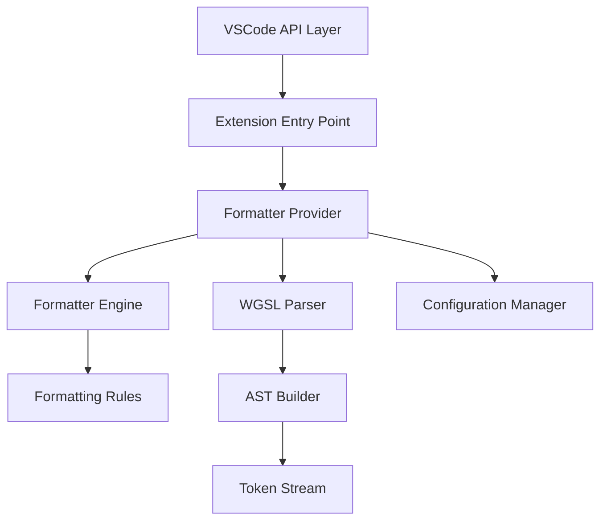

# 技术设计文档

## 概述

WGSL Formatter VSCode Extension 是一个为 WebGPU Shading Language (WGSL) 提供代码格式化功能的 Visual Studio Code 扩展插件。该扩展通过实现 VSCode 的 DocumentFormattingEditProvider 和 DocumentRangeFormattingEditProvider 接口，为 WGSL 文件提供全文档和选定范围的格式化支持。

### 核心目标

- 提供快速、可靠的 WGSL 代码格式化功能
- 支持用户自定义格式化规则（缩进大小、制表符/空格）
- 确保跨平台兼容性（Windows、macOS、Linux）
- 保持良好的性能表现（<500ms 处理 1000 行代码）
- 提供清晰的错误处理和用户反馈

### 技术栈

- **开发语言**: TypeScript
- **运行时**: Node.js
- **目标平台**: VSCode 1.75.0+
- **构建工具**: esbuild（用于打包和优化）
- **测试框架**: Vitest（单元测试）+ fast-check（属性测试）
- **代码质量**: ESLint + Prettier

## 架构

### 整体架构

该扩展采用分层架构设计，将关注点清晰分离：



### 架构层次

1. **VSCode API Layer**: 与 VSCode 编辑器交互的接口层
2. **Extension Entry Point**: 扩展激活和注册逻辑
3. **Formatter Provider**: 实现 VSCode 格式化提供者接口
4. **WGSL Parser**: 解析 WGSL 代码生成抽象语法树（AST）
5. **Formatter Engine**: 核心格式化逻辑，遍历 AST 并应用格式化规则
6. **Configuration Manager**: 管理用户配置和默认设置
7. **Formatting Rules**: 具体的格式化规则实现

### 设计原则

- **单一职责**: 每个模块只负责一个明确的功能
- **依赖注入**: 通过接口和依赖注入实现松耦合
- **错误隔离**: 格式化错误不应影响 VSCode 编辑器稳定性
- **性能优先**: 使用增量解析和缓存机制优化性能
- **可测试性**: 核心逻辑与 VSCode API 解耦，便于单元测试

## 组件和接口

### 1. Extension Entry Point

**职责**: 扩展的激活和注册逻辑

**接口**:
```typescript
export function activate(context: vscode.ExtensionContext): void;
export function deactivate(): void;
```

**实现细节**:
- 在 `activate` 函数中注册格式化提供者
- 注册配置变更监听器
- 初始化日志输出通道
- 设置语言配置（括号匹配、注释等）

### 2. WGSLFormattingProvider

**职责**: 实现 VSCode 格式化提供者接口

**接口**:
```typescript
class WGSLFormattingProvider implements 
    vscode.DocumentFormattingEditProvider,
    vscode.DocumentRangeFormattingEditProvider {
    
    provideDocumentFormattingEdits(
        document: vscode.TextDocument,
        options: vscode.FormattingOptions,
        token: vscode.CancellationToken
    ): vscode.ProviderResult<vscode.TextEdit[]>;
    
    provideDocumentRangeFormattingEdits(
        document: vscode.TextDocument,
        range: vscode.Range,
        options: vscode.FormattingOptions,
        token: vscode.CancellationToken
    ): vscode.ProviderResult<vscode.TextEdit[]>;
}
```

**实现细节**:
- 调用 FormatterEngine 执行格式化
- 处理取消令牌（CancellationToken）
- 捕获并记录格式化错误
- 返回 TextEdit 数组表示格式化变更

### 3. ConfigurationManager

**职责**: 管理扩展配置

**接口**:
```typescript
interface FormattingConfig {
    indentSize: number;
    useTabs: boolean;
    insertFinalNewline: boolean;
    trimTrailingWhitespace: boolean;
    maxLineLength: number;
    enableLineWrapping: boolean;
}

class ConfigurationManager {
    getConfig(): FormattingConfig;
    onConfigChange(callback: (config: FormattingConfig) => void): vscode.Disposable;
}
```

**配置项**:
- `wgslFormatter.indentSize`: 缩进大小（默认 4）
- `wgslFormatter.useTabs`: 使用制表符（默认 false）
- `wgslFormatter.maxLineLength`: 最大行长度（默认 100）
- `wgslFormatter.enableLineWrapping`: 启用自动换行（默认 true）
- 继承 VSCode 编辑器配置：`editor.insertFinalNewline`、`editor.trimTrailingWhitespace`

### 4. WGSLParser

**职责**: 解析 WGSL 代码生成 AST

**接口**:
```typescript
interface ParseResult {
    ast: ASTNode | null;
    errors: ParseError[];
}

interface ParseError {
    message: string;
    line: number;
    column: number;
}

class WGSLParser {
    parse(source: string): ParseResult;
}
```

**实现策略**:
- 使用递归下降解析器
- 支持错误恢复，尽可能解析有效部分
- 生成位置信息完整的 AST 节点

### 5. FormatterEngine

**职责**: 核心格式化逻辑

**接口**:
```typescript
interface FormatOptions {
    indentSize: number;
    useTabs: boolean;
    insertFinalNewline: boolean;
    trimTrailingWhitespace: boolean;
    maxLineLength: number;
    enableLineWrapping: boolean;
}

interface FormatResult {
    formattedText: string;
    success: boolean;
    error?: string;
}

class FormatterEngine {
    format(source: string, options: FormatOptions): FormatResult;
    formatRange(source: string, startLine: number, endLine: number, options: FormatOptions): FormatResult;
}
```

**实现细节**:
- 调用 WGSLParser 解析代码
- 遍历 AST 并应用格式化规则
- 生成格式化后的代码字符串
- 处理部分格式化（范围格式化）

### 6. FormattingRules

**职责**: 具体的格式化规则实现

**规则列表**:
- **IndentationRule**: 处理缩进
- **SpacingRule**: 处理运算符和逗号周围的空格
- **AlignmentRule**: 对齐结构体字段
- **BlankLineRule**: 保留和规范化空行
- **TrailingWhitespaceRule**: 移除行尾空格
- **FinalNewlineRule**: 确保文件以换行符结尾
- **LineWrappingRule**: 处理行长度限制和自动换行

**接口**:
```typescript
interface FormattingRule {
    apply(node: ASTNode, context: FormatContext): void;
}

interface FormatContext {
    indentLevel: number;
    options: FormatOptions;
    output: string[];
}
```

### LineWrappingRule 详细设计

**职责**: 检测并处理超过最大行长度的代码行，应用智能换行策略

**换行策略**:

1. **函数签名换行**:
   - 当函数签名（包括属性、函数名、参数列表、返回类型）超过最大行长度时触发
   - 每个参数独占一行，使用额外的缩进级别（原缩进 + 1）
   - 右括号和返回类型放在单独的行上，使用原缩进级别
   - 左花括号放在新行上，使用原缩进级别

   **示例**:
   ```wgsl
   // 换行前（假设 maxLineLength = 60）
   fn computeShading(position: vec3<f32>, normal: vec3<f32>, lightDir: vec3<f32>, viewDir: vec3<f32>) -> vec3<f32> {
   
   // 换行后
   fn computeShading(
       position: vec3<f32>,
       normal: vec3<f32>,
       lightDir: vec3<f32>,
       viewDir: vec3<f32>
   ) -> vec3<f32>
   {
   ```

2. **表达式换行**:
   - 当表达式超过最大行长度时，在二元运算符处换行
   - 运算符保留在前一行末尾
   - 续行使用额外的缩进级别（原缩进 + 1）
   - 优先在低优先级运算符处换行（如 `+`, `-` 优先于 `*`, `/`）

   **示例**:
   ```wgsl
   // 换行前
   let result = baseColor * lightIntensity + ambientColor * ambientFactor + specularColor * specularIntensity;
   
   // 换行后
   let result = baseColor * lightIntensity +
       ambientColor * ambientFactor +
       specularColor * specularIntensity;
   ```

3. **函数调用换行**:
   - 当函数调用超过最大行长度时，每个参数独占一行
   - 参数使用额外的缩进级别
   - 右括号与最后一个参数在同一行或单独一行（取决于长度）

   **示例**:
   ```wgsl
   // 换行前
   let color = calculateLighting(position, normal, lightPosition, lightColor, viewPosition, materialProperties);
   
   // 换行后
   let color = calculateLighting(
       position,
       normal,
       lightPosition,
       lightColor,
       viewPosition,
       materialProperties
   );
   ```

4. **结构体字段**:
   - 结构体字段已经每个独占一行，不需要额外的换行处理
   - 保持现有的对齐格式

**换行算法伪代码**:

```typescript
function shouldWrapLine(line: string, maxLength: number): boolean {
    return line.length > maxLength;
}

function wrapFunctionSignature(func: FunctionDecl, indent: string, maxLength: number): string[] {
    const lines: string[] = [];
    
    // 添加属性（每个独占一行）
    for (const attr of func.attributes) {
        lines.push(`${indent}@${attr.name}`);
    }
    
    // 构建函数签名第一行
    const signatureLine = `${indent}fn ${func.name}(`;
    
    // 检查是否需要换行
    const fullSignature = buildFullSignature(func);
    if (fullSignature.length <= maxLength) {
        // 不需要换行，返回单行签名
        lines.push(fullSignature);
        return lines;
    }
    
    // 需要换行：每个参数一行
    lines.push(signatureLine);
    
    const paramIndent = indent + getIndentUnit();
    for (let i = 0; i < func.parameters.length; i++) {
        const param = func.parameters[i];
        const paramLine = `${paramIndent}${param.name}: ${param.varType}`;
        const suffix = i < func.parameters.length - 1 ? ',' : '';
        lines.push(paramLine + suffix);
    }
    
    // 添加右括号和返回类型
    const returnType = func.returnType ? ` -> ${func.returnType}` : '';
    lines.push(`${indent})${returnType}`);
    
    // 添加左花括号
    lines.push(`${indent}{`);
    
    return lines;
}

function wrapExpression(expr: Expression, indent: string, maxLength: number): string[] {
    const lines: string[] = [];
    
    if (expr.kind !== 'binary') {
        // 非二元表达式不换行
        return [formatExpression(expr)];
    }
    
    // 查找换行点（运算符位置）
    const breakPoints = findOperatorBreakPoints(expr);
    
    // 按优先级排序换行点（低优先级优先）
    breakPoints.sort((a, b) => a.priority - b.priority);
    
    let currentLine = indent;
    let currentExpr = expr;
    const contIndent = indent + getIndentUnit();
    
    for (const breakPoint of breakPoints) {
        const leftPart = formatExpression(breakPoint.left);
        const operator = breakPoint.operator;
        
        if ((currentLine + leftPart + ' ' + operator).length > maxLength) {
            // 需要在此处换行
            lines.push(currentLine + leftPart + ' ' + operator);
            currentLine = contIndent;
            currentExpr = breakPoint.right;
        } else {
            currentLine += leftPart + ' ' + operator + ' ';
        }
    }
    
    // 添加最后一部分
    lines.push(currentLine + formatExpression(currentExpr));
    
    return lines;
}

function findOperatorBreakPoints(expr: Expression): BreakPoint[] {
    const breakPoints: BreakPoint[] = [];
    
    // 递归遍历表达式树，收集所有运算符位置
    function traverse(e: Expression, priority: number) {
        if (e.kind === 'binary') {
            const opPriority = getOperatorPriority(e.operator);
            breakPoints.push({
                left: e.left,
                operator: e.operator,
                right: e.right,
                priority: opPriority
            });
            traverse(e.left, opPriority);
            traverse(e.right, opPriority);
        }
    }
    
    traverse(expr, 0);
    return breakPoints;
}

function getOperatorPriority(operator: string): number {
    // 低优先级运算符优先换行
    const priorities = {
        '||': 1,
        '&&': 2,
        '==': 3, '!=': 3,
        '<': 4, '>': 4, '<=': 4, '>=': 4,
        '+': 5, '-': 5,
        '*': 6, '/': 6, '%': 6,
    };
    return priorities[operator] || 10;
}
```

**接口扩展**:

```typescript
interface LineWrappingRule extends FormattingRule {
    shouldWrap(line: string, maxLength: number): boolean;
    wrapFunctionSignature(func: FunctionDecl, context: FormatContext): string[];
    wrapExpression(expr: Expression, context: FormatContext): string[];
    wrapFunctionCall(call: Expression, context: FormatContext): string[];
}
```

## 数据模型

### AST 节点类型

```typescript
enum ASTNodeType {
    Program,
    FunctionDecl,
    StructDecl,
    VariableDecl,
    Statement,
    Expression,
    Comment,
    Attribute,
}

interface ASTNode {
    type: ASTNodeType;
    start: Position;
    end: Position;
    children: ASTNode[];
}

interface Position {
    line: number;
    column: number;
    offset: number;
}
```

### 具体节点类型

```typescript
interface FunctionDecl extends ASTNode {
    type: ASTNodeType.FunctionDecl;
    name: string;
    parameters: VariableDecl[];
    returnType: string | null;
    attributes: Attribute[];
    body: Statement[];
}

interface StructDecl extends ASTNode {
    type: ASTNodeType.StructDecl;
    name: string;
    fields: VariableDecl[];
}

interface VariableDecl extends ASTNode {
    type: ASTNodeType.VariableDecl;
    name: string;
    varType: string;
    initializer: Expression | null;
}

interface Comment extends ASTNode {
    type: ASTNodeType.Comment;
    text: string;
    isBlockComment: boolean;
}
```

### 配置数据模型

```typescript
interface ExtensionConfig {
    formatting: FormattingConfig;
    performance: PerformanceConfig;
}

interface PerformanceConfig {
    maxFileSize: number;        // 最大文件大小（字节）
    formatTimeout: number;      // 格式化超时时间（毫秒）
    showProgressThreshold: number; // 显示进度提示的行数阈值
}
```

### 格式化结果模型

```typescript
interface TextEdit {
    range: Range;
    newText: string;
}

interface Range {
    start: Position;
    end: Position;
}

interface FormattingDiagnostic {
    severity: 'error' | 'warning' | 'info';
    message: string;
    location?: Position;
}
```


## 正确性属性

*属性是指在系统的所有有效执行中都应该成立的特征或行为——本质上是关于系统应该做什么的形式化陈述。属性充当人类可读规范和机器可验证正确性保证之间的桥梁。*

### 属性 1: 格式化往返保持语义

*对于任意*有效的 WGSL 代码，解析后格式化再解析应该产生等价的抽象语法树（AST）

**验证需求: 3.3**

### 属性 2: 格式化处理所有语法结构

*对于任意*有效的 WGSL 语法结构（函数、结构体、变量声明、注释），格式化操作应该成功完成并返回格式化后的代码

**验证需求: 3.2**

### 属性 3: 运算符空格规则

*对于任意*包含运算符的 WGSL 代码，格式化后运算符前后应该有空格（除非在行首或行尾）

**验证需求: 4.2**

### 属性 4: 逗号后空格规则

*对于任意*包含逗号的 WGSL 代码，格式化后逗号后应该有一个空格

**验证需求: 4.3**

### 属性 5: 结构体字段对齐

*对于任意*结构体声明，格式化后所有字段的类型声明应该在同一列对齐

**验证需求: 4.4**

### 属性 6: 空行保留

*对于任意*包含连续空行的 WGSL 代码，格式化后应该保留空行（规范化为最多一个空行）用于逻辑分组

**验证需求: 4.5**

### 属性 7: 移除行尾空格

*对于任意*WGSL 代码，格式化后任何行都不应该以空格或制表符结尾

**验证需求: 4.6**

### 属性 8: 文件结尾换行符

*对于任意*WGSL 代码，格式化后文件应该以恰好一个换行符结尾

**验证需求: 4.7**

### 属性 9: 范围格式化边界

*对于任意*WGSL 代码和任意有效的行范围，范围格式化应该只修改指定范围内的代码，范围外的代码保持完全不变

**验证需求: 5.1, 5.2**

### 属性 10: 范围扩展到完整语法单元

*对于任意*包含不完整语法结构的选定范围，格式化器应该扩展范围到最近的完整语法单元（函数、结构体等）

**验证需求: 5.3**

### 属性 11: 格式化失败时内容不变

*对于任意*导致格式化失败的输入（语法错误、内部错误等），原始文档内容应该保持完全不变

**验证需求: 3.4, 7.4**

### 属性 12: 语法错误时错误报告

*对于任意*包含语法错误的 WGSL 代码，格式化器应该生成包含错误位置和描述的诊断信息

**验证需求: 7.1**

### 属性 13: 内部错误处理

*对于任意*导致内部错误的场景，扩展应该捕获异常、记录错误堆栈，并向用户显示友好的错误消息

**验证需求: 7.2**

### 属性 14: 超时取消机制

*对于任意*超过配置超时时间的格式化操作，扩展应该取消操作并显示超时消息

**验证需求: 7.3**

### 属性 15: 配置变更立即生效

*对于任意*配置项的变更，下一次格式化操作应该使用新的配置值

**验证需求: 9.3**

### 属性 16: 换行符风格保持

*对于任意*使用 CRLF 或 LF 换行符的 WGSL 代码，格式化后应该保持原有的换行符风格

**验证需求: 10.5**

### 属性 17: 默认配置可用性

*对于任意*WGSL 代码，在没有用户配置的情况下，格式化器应该使用默认配置（4 个空格缩进）成功格式化

**验证需求: 1.3, 4.1, 9.4**

### 属性 18: 大文件进度提示

*对于任意*超过配置行数阈值（默认 5000 行）的文件，格式化操作应该显示进度提示

**验证需求: 8.3**

### 属性 19: 格式化提供者注册

*对于任意*语言 ID 为 "wgsl" 的文档，格式化提供者应该被正确调用并返回格式化编辑

**验证需求: 2.3, 3.1**

### 属性 20: 格式化失败时警告记录

*对于任意*在保存时自动格式化失败的场景，扩展应该在输出面板记录警告但不阻止文件保存

**验证需求: 6.3**

### 属性 21: 行长度限制遵守

*对于任意*启用自动换行的 WGSL 代码，格式化后所有行的长度应该不超过配置的最大行长度（除非单个标识符或字符串字面量本身超过限制）

**验证需求: 11.3**

### 属性 22: 函数签名换行格式

*对于任意*需要换行的函数签名，格式化后应该满足：每个参数独占一行并正确缩进，右括号和返回类型在单独的行上，左花括号在新行上

**验证需求: 11.4, 11.5, 11.6**

### 属性 23: 表达式换行保持语义

*对于任意*需要换行的长表达式，格式化后应该在运算符处换行，续行使用额外缩进，且表达式的求值顺序和语义保持不变

**验证需求: 11.8, 11.9**

### 属性 24: 换行配置响应

*对于任意*WGSL 代码，当禁用自动换行配置时，格式化器不应该对任何超长行进行换行处理

**验证需求: 11.2, 11.10**

### 属性 25: 换行幂等性

*对于任意*启用自动换行的 WGSL 代码，连续两次格式化操作应该产生完全相同的结果

**验证需求: 11.12**

### 属性 26: 最大行长度配置应用

*对于任意*有效的最大行长度配置值（如 80、100、120），格式化器应该正确读取并应用该配置进行换行决策

**验证需求: 11.1**

## 错误处理

### 错误分类

1. **语法错误**: WGSL 代码包含语法错误
2. **内部错误**: 格式化器或解析器的 bug
3. **超时错误**: 格式化操作超过时间限制
4. **配置错误**: 用户配置无效
5. **系统错误**: 文件读写、内存不足等系统级错误

### 错误处理策略

#### 语法错误处理

- **策略**: 错误恢复 + 部分格式化
- **实现**:
  - 解析器在遇到语法错误时尝试恢复并继续解析
  - 格式化器只处理成功解析的部分
  - 如果无法恢复，返回原始内容
  - 在输出面板显示详细的语法错误信息（行号、列号、错误描述）

#### 内部错误处理

- **策略**: 捕获 + 记录 + 回退
- **实现**:
  - 在格式化提供者层面捕获所有异常
  - 记录完整的错误堆栈到输出面板
  - 返回空的编辑数组（保持原始内容）
  - 向用户显示通知："格式化失败，请查看输出面板了解详情"

#### 超时错误处理

- **策略**: 主动取消 + 通知
- **实现**:
  - 使用 VSCode 的 CancellationToken 机制
  - 在格式化循环中定期检查取消令牌
  - 超时后立即停止处理并返回
  - 显示通知："格式化超时，文件可能过大或过于复杂"

#### 配置错误处理

- **策略**: 验证 + 回退到默认值
- **实现**:
  - 在读取配置时验证值的有效性
  - 无效值使用默认值替代
  - 在输出面板记录警告："配置项 X 无效，使用默认值 Y"

#### 系统错误处理

- **策略**: 捕获 + 记录 + 用户通知
- **实现**:
  - 捕获文件系统和内存相关错误
  - 记录到输出面板
  - 向用户显示具体的错误原因

### 错误日志

所有错误都应该记录到专用的输出通道：

```typescript
const outputChannel = vscode.window.createOutputChannel('WGSL Formatter');

function logError(error: Error, context: string): void {
    const timestamp = new Date().toISOString();
    outputChannel.appendLine(`[${timestamp}] ERROR in ${context}:`);
    outputChannel.appendLine(error.message);
    outputChannel.appendLine(error.stack || 'No stack trace available');
}
```

### 用户通知策略

- **错误**: 使用 `vscode.window.showErrorMessage`，包含"查看详情"按钮打开输出面板
- **警告**: 使用 `vscode.window.showWarningMessage`，不打断用户工作流
- **信息**: 使用 `vscode.window.showInformationMessage`，仅用于成功的重要操作

## 测试策略

### 双重测试方法

本项目采用单元测试和基于属性的测试相结合的方法，以确保全面的代码覆盖和正确性验证。

#### 单元测试

**目的**: 验证特定示例、边缘情况和错误条件

**工具**: Vitest

**覆盖范围**:
- 具体的格式化示例（简单函数、复杂结构体等）
- 边缘情况（空文件、只有注释的文件、超长行等）
- 错误条件（语法错误、无效配置等）
- 组件集成点（配置管理器、格式化提供者等）

**示例**:
```typescript
describe('WGSLFormatter', () => {
    it('should format a simple function declaration', () => {
        const input = 'fn main(){return;}';
        const expected = 'fn main() {\n    return;\n}\n';
        const result = formatter.format(input, defaultOptions);
        expect(result.formattedText).toBe(expected);
    });

    it('should handle empty file', () => {
        const input = '';
        const result = formatter.format(input, defaultOptions);
        expect(result.success).toBe(true);
        expect(result.formattedText).toBe('');
    });

    it('should preserve content on syntax error', () => {
        const input = 'fn main( { invalid syntax }';
        const result = formatter.format(input, defaultOptions);
        expect(result.formattedText).toBe(input);
    });
});
```

#### 基于属性的测试

**目的**: 验证跨所有输入的通用属性

**工具**: fast-check

**配置**: 每个属性测试最少运行 100 次迭代

**标签格式**: 每个测试必须包含注释引用设计文档中的属性
```typescript
// Feature: wgsl-formatter-vscode-extension, Property 1: 格式化往返保持语义
```

**覆盖范围**:
- 格式化往返属性（解析-格式化-解析）
- 格式化规则的通用性（空格、缩进、对齐等）
- 范围格式化的边界保持
- 错误处理的鲁棒性
- 配置变更的响应性

**示例**:
```typescript
import fc from 'fast-check';

// Feature: wgsl-formatter-vscode-extension, Property 1: 格式化往返保持语义
describe('Property: Format round-trip preserves semantics', () => {
    it('should preserve AST structure after format round-trip', () => {
        fc.assert(
            fc.property(
                wgslCodeArbitrary(), // 生成随机有效的 WGSL 代码
                (code) => {
                    const ast1 = parser.parse(code).ast;
                    const formatted = formatter.format(code, defaultOptions).formattedText;
                    const ast2 = parser.parse(formatted).ast;
                    expect(astEqual(ast1, ast2)).toBe(true);
                }
            ),
            { numRuns: 100 }
        );
    });
});

// Feature: wgsl-formatter-vscode-extension, Property 7: 移除行尾空格
describe('Property: Remove trailing whitespace', () => {
    it('should remove all trailing whitespace from any code', () => {
        fc.assert(
            fc.property(
                wgslCodeArbitrary(),
                (code) => {
                    const formatted = formatter.format(code, defaultOptions).formattedText;
                    const lines = formatted.split('\n');
                    for (const line of lines) {
                        expect(line).not.toMatch(/[ \t]$/);
                    }
                }
            ),
            { numRuns: 100 }
        );
    });
});

// Feature: wgsl-formatter-vscode-extension, Property 9: 范围格式化边界
describe('Property: Range formatting boundaries', () => {
    it('should only modify code within specified range', () => {
        fc.assert(
            fc.property(
                wgslCodeArbitrary(),
                fc.integer({ min: 0, max: 50 }),
                fc.integer({ min: 0, max: 50 }),
                (code, startLine, endLine) => {
                    const lines = code.split('\n');
                    const validStart = Math.min(startLine, lines.length - 1);
                    const validEnd = Math.min(Math.max(validStart, endLine), lines.length - 1);
                    
                    const result = formatter.formatRange(code, validStart, validEnd, defaultOptions);
                    const resultLines = result.formattedText.split('\n');
                    
                    // 范围外的行应该保持不变
                    for (let i = 0; i < validStart; i++) {
                        expect(resultLines[i]).toBe(lines[i]);
                    }
                    for (let i = validEnd + 1; i < lines.length; i++) {
                        expect(resultLines[i]).toBe(lines[i]);
                    }
                }
            ),
            { numRuns: 100 }
        );
    });
});

// Feature: wgsl-formatter-vscode-extension, Property 21: 行长度限制遵守
describe('Property: Line length limit compliance', () => {
    it('should ensure all lines are within max length after formatting', () => {
        fc.assert(
            fc.property(
                wgslCodeArbitrary(),
                fc.integer({ min: 60, max: 120 }),
                (code, maxLength) => {
                    const options = { ...defaultOptions, enableLineWrapping: true, maxLineLength: maxLength };
                    const result = formatter.format(code, options);
                    const lines = result.formattedText.split('\n');
                    
                    for (const line of lines) {
                        // 允许单个标识符或字符串字面量超过限制
                        const trimmed = line.trim();
                        if (trimmed.length > maxLength) {
                            // 检查是否是单个不可分割的标记
                            expect(isSingleIndivisibleToken(trimmed)).toBe(true);
                        } else {
                            expect(line.length).toBeLessThanOrEqual(maxLength);
                        }
                    }
                }
            ),
            { numRuns: 100 }
        );
    });
});

// Feature: wgsl-formatter-vscode-extension, Property 22: 函数签名换行格式
describe('Property: Function signature wrapping format', () => {
    it('should format wrapped function signatures correctly', () => {
        fc.assert(
            fc.property(
                functionDeclArbitrary(),
                fc.integer({ min: 40, max: 80 }),
                (func, maxLength) => {
                    const options = { ...defaultOptions, enableLineWrapping: true, maxLineLength: maxLength };
                    const funcCode = generateFunctionCode(func);
                    
                    // 如果函数签名需要换行
                    if (funcCode.split('\n')[0].length > maxLength) {
                        const result = formatter.format(funcCode, options);
                        const lines = result.formattedText.split('\n');
                        
                        // 验证每个参数独占一行
                        const paramLines = lines.filter(l => l.includes(':') && !l.includes('fn '));
                        expect(paramLines.length).toBe(func.parameters.length);
                        
                        // 验证参数有额外缩进
                        for (const paramLine of paramLines) {
                            expect(paramLine.startsWith('    ')).toBe(true); // 假设基础缩进是 4 空格
                        }
                        
                        // 验证右括号在单独的行上
                        const closingParenLine = lines.find(l => l.trim().startsWith(')'));
                        expect(closingParenLine).toBeDefined();
                        
                        // 验证左花括号在新行上
                        const openBraceLine = lines.find(l => l.trim() === '{');
                        expect(openBraceLine).toBeDefined();
                    }
                }
            ),
            { numRuns: 100 }
        );
    });
});

// Feature: wgsl-formatter-vscode-extension, Property 23: 表达式换行保持语义
describe('Property: Expression wrapping preserves semantics', () => {
    it('should preserve expression semantics after wrapping', () => {
        fc.assert(
            fc.property(
                longExpressionArbitrary(),
                fc.integer({ min: 40, max: 80 }),
                (expr, maxLength) => {
                    const options = { ...defaultOptions, enableLineWrapping: true, maxLineLength: maxLength };
                    const exprCode = `let result = ${expr};`;
                    
                    const ast1 = parser.parse(exprCode).ast;
                    const formatted = formatter.format(exprCode, options).formattedText;
                    const ast2 = parser.parse(formatted).ast;
                    
                    // 验证 AST 等价（语义保持）
                    expect(astEqual(ast1, ast2)).toBe(true);
                    
                    // 验证续行有额外缩进
                    const lines = formatted.split('\n');
                    if (lines.length > 1) {
                        for (let i = 1; i < lines.length; i++) {
                            const indentLevel = getIndentLevel(lines[i]);
                            const baseIndent = getIndentLevel(lines[0]);
                            expect(indentLevel).toBeGreaterThan(baseIndent);
                        }
                    }
                }
            ),
            { numRuns: 100 }
        );
    });
});

// Feature: wgsl-formatter-vscode-extension, Property 24: 换行配置响应
describe('Property: Line wrapping configuration response', () => {
    it('should not wrap lines when line wrapping is disabled', () => {
        fc.assert(
            fc.property(
                wgslCodeArbitrary(),
                (code) => {
                    const options = { ...defaultOptions, enableLineWrapping: false, maxLineLength: 60 };
                    const result = formatter.format(code, options);
                    
                    // 计算原始代码和格式化后代码的行数
                    const originalLines = code.split('\n').length;
                    const formattedLines = result.formattedText.split('\n').length;
                    
                    // 禁用换行时，行数不应该因为换行而增加
                    // （可能因为其他格式化规则略有变化，但不应该有显著的换行增加）
                    expect(formattedLines).toBeLessThanOrEqual(originalLines + 5);
                }
            ),
            { numRuns: 100 }
        );
    });
});

// Feature: wgsl-formatter-vscode-extension, Property 25: 换行幂等性
describe('Property: Line wrapping idempotence', () => {
    it('should produce identical results when formatting twice', () => {
        fc.assert(
            fc.property(
                wgslCodeArbitrary(),
                fc.integer({ min: 60, max: 120 }),
                (code, maxLength) => {
                    const options = { ...defaultOptions, enableLineWrapping: true, maxLineLength: maxLength };
                    
                    const firstFormat = formatter.format(code, options).formattedText;
                    const secondFormat = formatter.format(firstFormat, options).formattedText;
                    
                    expect(secondFormat).toBe(firstFormat);
                }
            ),
            { numRuns: 100 }
        );
    });
});

// Feature: wgsl-formatter-vscode-extension, Property 26: 最大行长度配置应用
describe('Property: Max line length configuration application', () => {
    it('should correctly apply different max line length configurations', () => {
        fc.assert(
            fc.property(
                wgslCodeArbitrary(),
                fc.constantFrom(80, 100, 120),
                (code, maxLength) => {
                    const options = { ...defaultOptions, enableLineWrapping: true, maxLineLength: maxLength };
                    const result = formatter.format(code, options);
                    
                    // 验证配置被正确读取和应用
                    expect(result.success).toBe(true);
                    
                    // 验证大部分行遵守配置的长度限制
                    const lines = result.formattedText.split('\n');
                    const compliantLines = lines.filter(l => l.length <= maxLength).length;
                    const complianceRate = compliantLines / lines.length;
                    
                    // 至少 90% 的行应该遵守长度限制
                    expect(complianceRate).toBeGreaterThanOrEqual(0.9);
                }
            ),
            { numRuns: 100 }
        );
    });
});
```

### 测试数据生成器

为了支持基于属性的测试，需要实现 WGSL 代码生成器：

```typescript
import fc from 'fast-check';

// 生成有效的 WGSL 标识符
const identifierArbitrary = () => 
    fc.string({ minLength: 1, maxLength: 20 })
      .filter(s => /^[a-zA-Z_][a-zA-Z0-9_]*$/.test(s))
      .filter(s => !isKeyword(s));

// 生成 WGSL 类型
const typeArbitrary = () => 
    fc.oneof(
        fc.constant('f32'),
        fc.constant('i32'),
        fc.constant('u32'),
        fc.constant('bool'),
        fc.tuple(typeArbitrary(), fc.integer({ min: 2, max: 4 }))
          .map(([t, n]) => `vec${n}<${t}>`)
    );

// 生成变量声明
const variableDeclArbitrary = () =>
    fc.record({
        name: identifierArbitrary(),
        type: typeArbitrary(),
    }).map(({ name, type }) => `var ${name}: ${type};`);

// 生成函数声明
const functionDeclArbitrary = () =>
    fc.record({
        name: identifierArbitrary(),
        params: fc.array(variableDeclArbitrary(), { maxLength: 5 }),
        returnType: fc.option(typeArbitrary(), { nil: undefined }),
        body: fc.array(variableDeclArbitrary(), { maxLength: 10 }),
    }).map(({ name, params, returnType, body }) => {
        const paramStr = params.join(', ');
        const returnStr = returnType ? ` -> ${returnType}` : '';
        const bodyStr = body.join('\n    ');
        return `fn ${name}(${paramStr})${returnStr} {\n    ${bodyStr}\n}`;
    });

// 生成完整的 WGSL 代码
const wgslCodeArbitrary = () =>
    fc.array(
        fc.oneof(
            variableDeclArbitrary(),
            functionDeclArbitrary(),
            structDeclArbitrary(),
            commentArbitrary()
        ),
        { minLength: 1, maxLength: 20 }
    ).map(decls => decls.join('\n\n'));
```

### 测试覆盖率目标

- **行覆盖率**: ≥ 90%
- **分支覆盖率**: ≥ 85%
- **函数覆盖率**: ≥ 95%

### 持续集成

- 所有测试在每次提交时自动运行
- 属性测试使用固定的随机种子以确保可重现性
- 性能基准测试每周运行一次，监控性能退化

### 测试组织

```
tests/
├── unit/
│   ├── parser.test.ts
│   ├── formatter.test.ts
│   ├── config.test.ts
│   └── provider.test.ts
├── property/
│   ├── format-roundtrip.test.ts
│   ├── formatting-rules.test.ts
│   ├── range-formatting.test.ts
│   └── error-handling.test.ts
├── integration/
│   └── extension.test.ts
└── fixtures/
    ├── valid/
    │   ├── simple.wgsl
    │   ├── complex.wgsl
    │   └── edge-cases.wgsl
    └── invalid/
        ├── syntax-error.wgsl
        └── incomplete.wgsl
```

